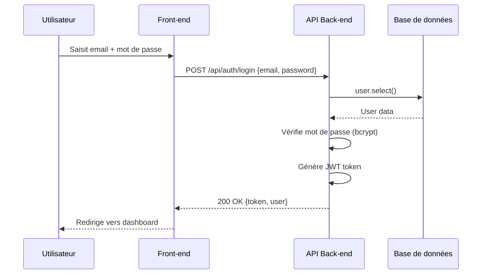

```mermaid
sequenceDiagram
     participant U as Utilisateur
     participant FE as Front-end
     participant API as API Back-end
     participant DB as Base de données

    U->>FE: Saisit email + mot de passe
    FE->>API: POST /api/auth/login {email, password}
    API->>DB: user.select()
    DB-->>API: User data
    API->>API: Vérifie mot de passe (bcrypt)
    API->>API: Génère JWT token
    API-->>FE: 200 OK {token, user}
    FE-->>U: Redirige vers dashboard
```
