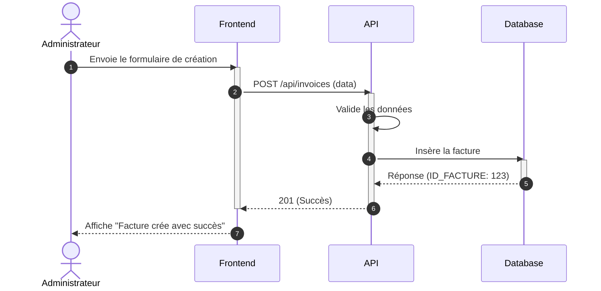

```mermaid
sequenceDiagram
    autonumber
    actor USER as Administrateur
    participant FRONT as Frontend
    participant API as API
    participant DB as Database

    USER->>FRONT: Envoie le formulaire de création

    activate FRONT
    FRONT->>API: POST /api/invoices (data)

    activate API
    API->>API: Valide les données
    API->>DB: Insère la facture

    activate DB
    DB-->>API: Réponse (ID_FACTURE: 123)
    deactivate DB

    API-->>FRONT: 201 (Succès)
    deactivate API

    deactivate FRONT

    FRONT-->>USER: Affiche "Facture crée avec succès"
```
