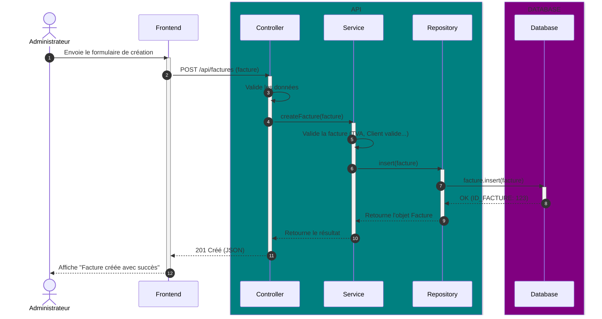

```mermaid
sequenceDiagram
    autonumber
    actor ADMIN as Administrateur
    participant FRONT as Frontend

    box Teal API
        participant R as Controller
        participant S as Service
        participant REP as Repository
    end

    box Purple DATABASE
      participant DB as Database
    end


    ADMIN->>FRONT: Envoie le formulaire de création
    activate FRONT

    FRONT->>R: POST /api/factures (facture)
    activate R
    R->>R: Valide les données

    R->>S: createFacture(facture)
    activate S

    S->>S: Valide la facture (TVA, Client valide...)

    S->>REP: insert(facture)
    activate REP

    REP->>DB: facture.insert(facture)
    activate DB
    DB-->>REP: OK (ID_FACTURE: 123)
    deactivate DB

    REP-->>S: Retourne l'objet Facture
    deactivate REP

    S-->>R: Retourne le résultat
    deactivate S

    R-->>FRONT: 201 Créé (JSON)
    deactivate R

    FRONT-->>ADMIN: Affiche "Facture créée avec succès"
    deactivate FRONT
```
